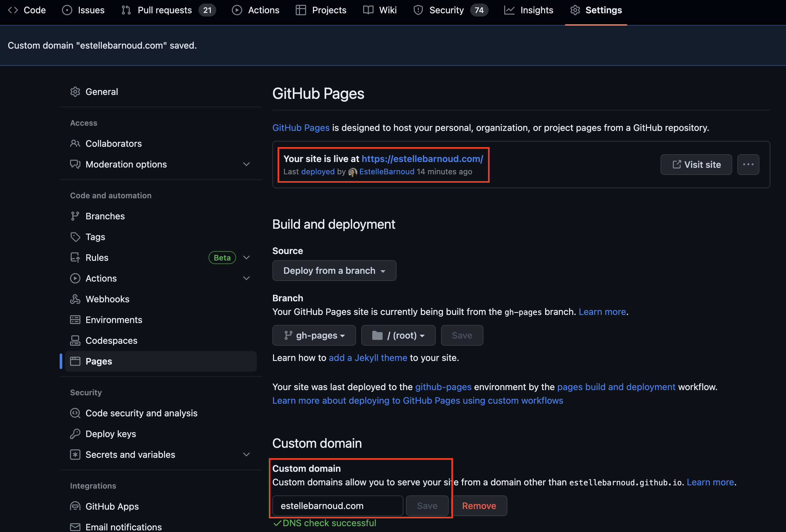

# My Personal Website

> ‼️ This website has been revamped into [estellewolski.vercel.app](https://estellewolski.vercel.app/). Please visit the [new repository](https://github.com/EstelleBarnoud/estellewolski.com) instead.

Self-hosted [portfolio website](https://estellebarnoud.com/) including a small introduction, experience, skills & interests.

### Technologies used

Front-end development using open source technologies:
- <a href=https://yarnpkg.com/en/>Yarn</a> for dependency management
- <a href=https://nodejs.org/en/ >Node.js</a> — JavaScript runtime
- <a href=https://reactjs.org/>React</a> — JavaScript library for building user interfaces
- <a href=https://material-ui.com/ >Material-ui</a> — React components that implement Google's Material Design.
- <a href=https://docs.github.com/en/pages>GitHub Pages</a> for publishing the static website


### Install
Install node & npm following the [npm documentation](https://docs.npmjs.com/cli/v8/configuring-npm/install). For example on MacOS:
```
brew install n
n <version>
```
**Tip**: to install the latest Long Time Support version, run `n lst`.
Note: you might need to prepend `sudo` to ensure you have the right permissions.

Then install yarn:
```
npm install --global yarn
```

### Develop

Install project dependencies:
```
yarn install
```
Run the project:
```
yarn start
```

This will open up a browser page with the compiled code.

### Deploy
Push the project to production with one of the following method:
- [free] [using GitHub Pages hosting](https://docs.github.com/en/pages/getting-started-with-github-pages/creating-a-github-pages-site#creating-your-site) — ⚠️Your repository must be named: `<user>.github.io`
- [used for this repository] [setting up your own subdomain](https://docs.github.com/en/pages/configuring-a-custom-domain-for-your-github-pages-site/managing-a-custom-domain-for-your-github-pages-site#configuring-a-subdomain) — ⚠️You must have a registered domain name. You can buy one in any domain name registrar, for example on [Google Domains](https://domains.google.com).  
  You can then specify your subdomain and check the status & location of your deploy in your repository Settings > Pages.
  
  **Note**: It can take up to a minute for the update to show.


Once configured, push your changes to your website:
```
yarn deploy
```

**Tip**: you can also consider creating a [GitHub Action workflow](https://docs.github.com/en/pages/getting-started-with-github-pages/configuring-a-publishing-source-for-your-github-pages-site#publishing-with-a-custom-github-actions-workflow) to deploy your website automatically.
